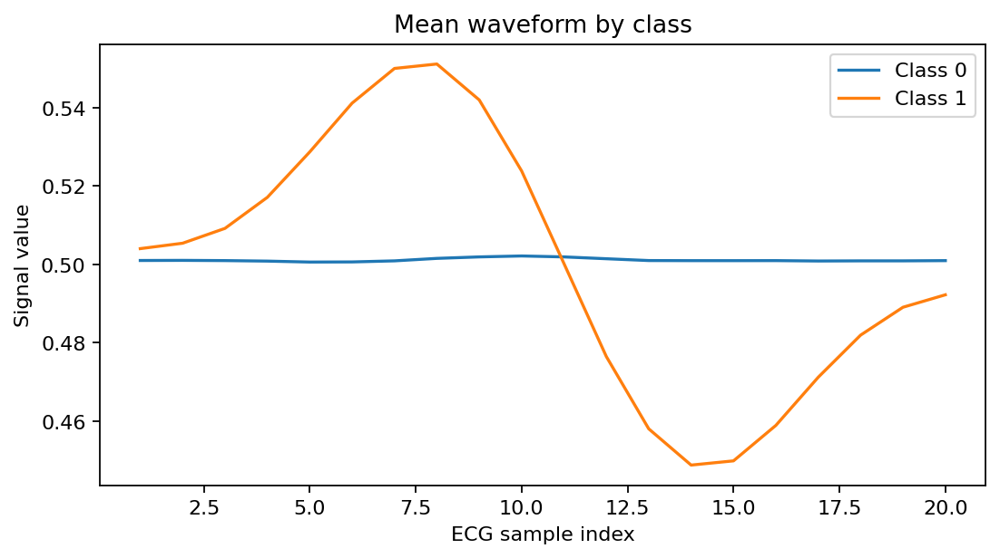
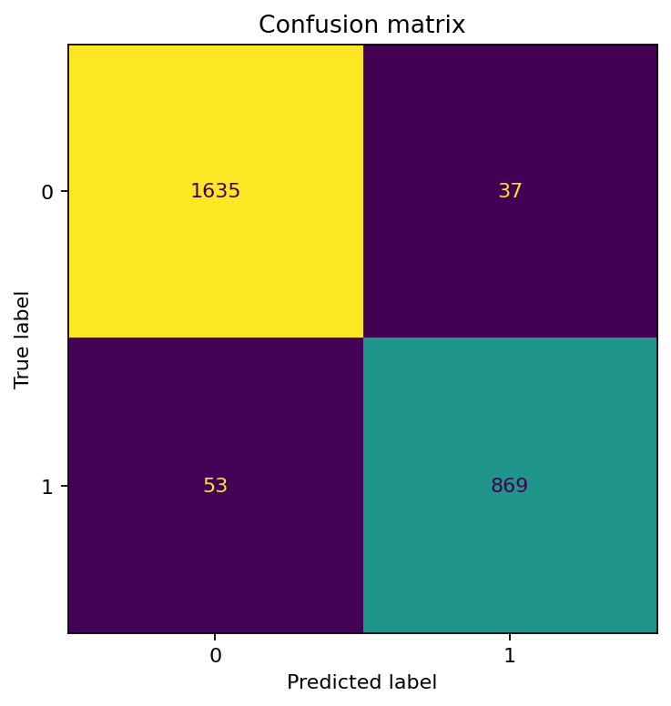
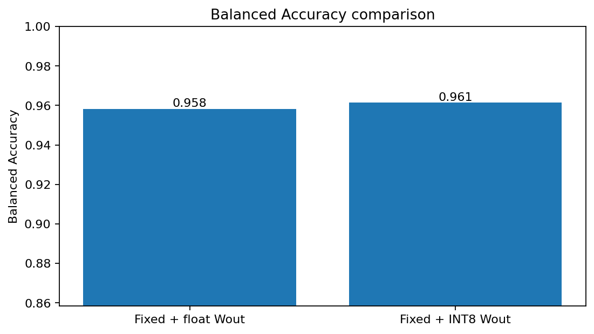

# ECG Reservoir Computing for FPGA

Thiết kế Reservoir Computing / Liquid State Machine (LSM) cho phân loại nhị phân các cửa sổ ECG dài 20 mẫu, theo hướng FPGA-oriented, fixed-point và không sử dụng neural-network bias.

> Đây là một dự án kỹ thuật và nghiên cứu mô phỏng. Ý nghĩa y khoa chính xác của nhãn `0/1` chưa được xác nhận từ metadata của dataset.

## 1. Tổng quan

Mục tiêu ban đầu là tìm hiểu Reservoir Computing bằng phần mềm, với Python/Brian2 là các hướng tham khảo, sau đó xây dựng một pipeline có thể triển khai trên FPGA.

```text
20 giá trị ECG liên tiếp
          ↓
64 neuron sparse LIF reservoir
          ↓
64 spike-count features
          ↓
INT8 no-bias readout
          ↓
signed score
          ↓
class 0 / 1
```

Ràng buộc phần cứng quan trọng: không dùng bias trong reservoir, LIF hay readout. Python fixed-point model là golden reference cho RTL; Brian2 chỉ là exploratory reference.

## 2. Trạng thái dự án

### Software và model

- [x] Kiểm tra dataset và parse mỗi cửa sổ thành 20 giá trị.
- [x] Group-wise train/validation/test split theo `original_index`.
- [x] NumPy float reference.
- [x] Integer/fixed-point FPGA golden model.
- [x] No-bias Ridge readout và INT8 quantization.
- [x] Metrics, diagnostics, plots và FPGA export.
- [x] Final sealed-test evaluation sau khi khóa kiến trúc.

### RTL

- [x] Phase 1: LIF processing element.
- [x] Phase 2: sparse ternary recurrent engine và one-step integration.
- [x] Phase 3: full 20-timestep reservoir controller.
- [x] Phase 4: INT8 readout MAC và full classifier.
- [x] Icarus Verilog regression bit-exact với golden vectors.

### FPGA physical implementation

- [ ] Vivado synthesis / implementation.
- [ ] Đo LUT, FF, BRAM, DSP, Fmax, power và energy/classification.
- [ ] Board deployment.

Target FPGA/board, clock và giao thức I/O vật lý chưa được chỉ định.

## 3. Định nghĩa bài toán

- Input: 20 mẫu ECG liên tiếp trong `value_sequence`.
- Output: nhãn nhị phân `0/1`.
- `finalLabel` được dùng làm target trong dataset.

> Nhãn chưa được xác nhận là bệnh, arrhythmia, QRS hay một chẩn đoán lâm sàng cụ thể.

## 4. Dataset

File gốc:

```text
data/raw/training_data_20_points_with_single_peak_hardneg.csv
```

Các số liệu đã audit:

| Thuộc tính | Giá trị |
|---|---:|
| Số dòng/cửa sổ | 17,214 |
| `original_index` duy nhất | 9,094 |
| Độ dài mỗi sequence | 20 |
| Cột input | `value_sequence` |
| Cột nhãn | `finalLabel` |
| Cột group | `original_index` |
| Cột độ dài gốc | `original_len` |
| Cột window | `generated_window_id` |
| Cột kiểm tra | `new_len` |

Chỉ `value_sequence` đi vào model. Các cột định danh và metadata không được dùng làm feature.

## 5. Data leakage prevention

Split được thực hiện theo group `original_index`, không chia ngẫu nhiên từng cửa sổ độc lập:

| Split | Số cửa sổ | Số group |
|---|---:|---:|
| Train | 12,059 | 6,365 |
| Validation | 2,594 | 1,364 |
| Test | 2,561 | 1,365 |

Đã kiểm tra:

```text
train ∩ validation = 0
train ∩ test       = 0
validation ∩ test  = 0
```

ở mức `original_index`, đồng thời kiểm tra exact waveform duplicate giữa các split. Test set được seal; không dùng test để chọn seed, hyperparameter, kích thước reservoir, quantization, threshold hay kiến trúc.

## 6. Kiến trúc model

Reservoir có 64 logical LIF neurons, recurrent graph sparse và cố định. Trạng thái đưa vào readout là tổng số spike của từng neuron trong 20 timestep.

Readout là một linear Ridge output không có intercept:

```text
score = W · x
```

không phải:

```text
score = W · x + b
```

Trong phần mềm, readout dùng `fit_intercept=False`, và luật phân lớp là `score >= 0 → class 1`, ngược lại class 0.

Không có bias trong reservoir, LIF update, readout hoặc RTL classifier.

## 7. Các tham số hardware-oriented đã khóa

| Thành phần | Giá trị |
|---|---|
| Logical neurons | 64 |
| Sequence length | 20 |
| Recurrent density | khoảng 10% |
| Recurrent edges | 403 |
| Input weights | `{0.5, 1, 2}` |
| Recurrent weights | `{-1, 0, +1}` |
| Leak | `7/8` |
| Input gain | `3/2` |
| Recurrent gain | `1/16` |
| Threshold | `2.5` |
| Reset | `0` |
| Input fixed-point | signed 12-bit Q10 |
| Membrane | signed 16-bit Q10 |
| Spike | 1 bit |
| Spike count | unsigned 5-bit, range 0…20 |
| Readout weight | signed INT8 |
| Readout accumulator/score | signed 20-bit |
| Physical LIF datapath target | 1 time-multiplexed PE |

## 8. Tối ưu hướng FPGA

- `Win = 0.5, 1, 2` được ánh xạ thành shift phải, direct và shift trái.
- Gain `3/2` tạo các hệ số shift/add `3/4, 3/2, 3`.
- Leak `7/8` thực hiện bằng `v - (v >> 3)`.
- Recurrent weights ternary chỉ cần add, subtract hoặc skip.
- Một physical datapath được time-multiplex cho 64 logical neurons để giảm tài nguyên, đổi lại tăng latency tuần tự.

## 9. Sparse recurrent graph

Graph export tại `outputs/fpga/weights/w_res_edges.csv` có các thống kê đã xác minh:

- 403 edges;
- density `9.838867%`;
- destination fan-in từ 2 đến 12, trung bình `6.296875`;
- 311 positive edges và 92 negative edges;
- không self-edge và không duplicate.

SHA-256 của edge CSV:

```text
77c8a1529768eb86bfd1b67a744034f5613d4433cb5f7d54060614440df6449f
```

SHA-256 của locked model dùng cho golden vectors:

```text
fad34b75150bc80f2c43ed8ffb302c29f446993122b9cb8f877ad4d5c3305b11
```

## 10. Đánh giá model

Metric chính là **Balanced Accuracy**, vì dataset có phân bố lớp không cân bằng và metric này cân bằng đóng góp của sensitivity và specificity.

Các metric được hỗ trợ gồm Accuracy, Balanced Accuracy, Precision, Sensitivity/Recall, Specificity, F1, MCC, ROC-AUC, PR-AUC và confusion matrix.

### Validation fixed-point + INT8 readout

| Metric | Giá trị |
|---|---:|
| Accuracy | 0.96530454896 |
| Balanced Accuracy | 0.96140982262 |
| Precision | 0.95414847162 |
| Sensitivity | 0.94793926247 |
| Specificity | 0.97488038278 |
| F1 | 0.95103373232 |
| MCC | 0.92418031394 |
| ROC-AUC | 0.99053116794 |
| PR-AUC | 0.96300747775 |

## 11. Final sealed-test results

Kết quả dưới đây được ghi sau khi kiến trúc đã khóa; không dùng để tune model:

| Metric | Giá trị |
|---|---:|
| Số mẫu | 2,561 |
| Accuracy | 0.97032409215 |
| Balanced Accuracy | 0.96799546265 |
| Precision | 0.95200000000 |
| Sensitivity | 0.96078431373 |
| Specificity | 0.97520661157 |
| F1 | 0.95637198622 |
| MCC | 0.93391011294 |
| ROC-AUC | 0.99333899821 |
| PR-AUC | 0.97854566985 |

Confusion matrix theo thứ tự `[[TN, FP], [FN, TP]]`:

```text
[[1652, 42],
 [  34, 833]]
```

## 12. Model-health diagnostics

Development diagnostics dùng train/validation, không dùng test:

| Chỉ số | Giá trị |
|---|---:|
| Train Balanced Accuracy | 0.96813759199 |
| Validation Balanced Accuracy | 0.96019354119 |
| Generalization gap | 0.00794405080 |
| Overfitting warning | false |
| Underfitting warning | false |
| Input clipping/underflow | rate 0.0 |
| Membrane saturation | rate 0.0 |
| Recurrent accumulator saturation | rate 0.0 |
| Readout accumulator saturation | rate 0.0 |

## 13. Brian2 reference

Brian2 là software reference cho SNN/LSM và đã chạy trên toàn bộ train/validation:

- validation Balanced Accuracy: `0.95303661688`;
- train runtime: `27.0540953 s`;
- validation runtime: `6.19131 s`;
- train non-zero spike-count rate: `0.9991111411`;
- validation non-zero spike-count rate: `0.9985965208`.

Brian2 không phải FPGA bit-exact reference. Event-driven floating-point recurrent accumulation có thể khác discrete NumPy recurrence ở một số phần tử. Golden reference chính thức là `src/hardware/hardware_model.py`.

## 14. FPGA golden model và vector flow

```text
Brian2/reference context
          ↓
NumPy model
          ↓
src/hardware/hardware_model.py
          ↓
FPGA golden vectors
          ↓
RTL simulation
          ↓
FPGA implementation
```

Các file golden vector chính:

- `outputs/fpga/golden_vectors/golden_vectors.npz`;
- `golden_vectors_manifest.json`;
- `inputs_q12.mem`;
- `spike_counts_5bit.mem`;
- `expected_scores_20bit.mem`;
- `expected_classes.mem`;
- `timestep_trace.csv`.

Bundle hiện tại gồm 4 train và 4 validation samples. RTL development chỉ dùng train/validation vectors; final test không được dùng.

## 15. RTL verification

Tất cả regression hiện dùng Icarus Verilog 13.0.

### Phase 1 — LIF PE

- 10,246 timestep vectors;
- 40,984 state comparisons;
- zero mismatch.

### Phase 2 — sparse recurrent engine

- 132 directed vectors;
- 396 recurrent comparisons;
- 10,240 golden neuron vectors;
- 30,720 recurrent comparisons;
- 71,680 one-step reservoir comparisons;
- zero mismatch.

### Phase 3 — full reservoir controller

- 14 segments;
- 280 timestep checkpoints;
- 17,920 exact comparisons cho từng nhóm membrane/input/recurrent/spike/count;
- 280 previous-spike-vector comparisons;
- 896 final-count comparisons;
- zero mismatch.

### Phase 4 — readout và classifier

- 14 readout vectors;
- 896 term-level MAC/product/accumulator comparisons;
- exact zero-score → class 1;
- 8 train/validation samples end-to-end;
- zero mismatch.

## 16. Readout accumulator và latency

Counts nằm trong `0…20`, weights lý thuyết trong `-128…127`, nên dot-product hợp lệ nằm trong:

```text
[-163840, 162560]
```

Signed 20-bit range là `[-524288, 524287]`; do đó accumulator 20-bit đủ an toàn và không legal vector nào gây saturation.

Cycle schedule đã xác minh bằng RTL testbench:

```text
Reservoir: 1320 cycles
Bridge:       2 cycles
Readout:     64 cycles
Total:     1386 cycles/sample
```

Đây là architectural cycle count, không phải thời gian thực. Thời gian thực còn phụ thuộc clock đạt được sau synthesis và Timing Analysis.

## 17. Cấu trúc project

```text
ecg_reservoir_fpga/
├── README.md
├── PROJECT_KNOWLEDGE.md
├── CHANGE_LOG.md
├── requirements.txt
├── configs/
├── data/
│   ├── raw/
│   └── splits/
├── src/
│   ├── data/
│   ├── model/
│   ├── evaluation/
│   ├── hardware/
│   └── utils/
├── scripts/
├── rtl/
│   ├── src/
│   ├── tb/
│   ├── mem/
│   └── scripts/
├── tests/
├── notebooks/
└── outputs/
    ├── fpga/
    └── runs/
```

## 18. Cài đặt

```bash
python -m pip install -r requirements.txt
```

Để chạy RTL regressions cần cài Icarus Verilog (`iverilog` và `vvp`) và đặt chúng trong `PATH`.

## 19. Cách chạy

```bash
python -m pytest -q
python -m compileall .
python rtl/scripts/run_lif_tb.py
python rtl/scripts/run_recurrent_tb.py
python rtl/scripts/run_controller_tb.py
python rtl/scripts/run_readout_tb.py
python rtl/scripts/run_classifier_tb.py
```

Các script chuẩn bị memory files trong `rtl/mem/` từ golden artifacts hiện có trước khi compile testbench.

## 20. Visualization

Một số figure đã lưu trong `outputs/runs/run_001/figures/`:







Các hình chỉ nhằm mô tả dữ liệu và model; không thay thế đánh giá thống kê hoặc xác nhận lâm sàng.

## 21. Known limitations

### Ý nghĩa nhãn

Metadata hiện có chưa xác nhận nhãn là chẩn đoán y khoa cụ thể.

### Patient-level identifiers

Dataset không cung cấp `patient_id` hoặc `record_id`, nên patient-independent split không thể xác minh. Group-wise `original_index` là cơ chế chống leakage mạnh nhất hiện có.

### FPGA target

Chưa có target device/board, clock constraint, reset protocol hoặc physical streaming interface.

### Hardware measurements

Chưa có số đo thực tế cho:

```text
LUT, FF, BRAM, DSP, Fmax, Power, Energy/classification
```

Không được hiểu cycle count hiện tại là timing hoặc power result.

## 22. Giai đoạn tiếp theo

Software pipeline và functional RTL đã hoàn tất, với toàn bộ regression hiện tại pass. Bước tiếp theo là FPGA synthesis và implementation sau khi target device/board và I/O contract được cung cấp.

Quy trình tiếp theo:

1. Chọn target FPGA và clock/reset contract.
2. Chạy synthesis.
3. Kiểm tra Timing Analysis và Place and Route.
4. Báo cáo LUT/FF/BRAM/DSP/Fmax/power bằng số đo thật.
5. Chỉ sau đó mới đánh giá board deployment.

## 23. Development rules

- Không tune bằng final sealed test.
- Không thêm bias hoặc intercept.
- Không âm thầm regenerate reservoir đã khóa.
- Không redesign nếu chưa có evidence từ model hoặc synthesis.
- Không claim synthesis, timing, power hay board result khi chưa đo.
- `src/hardware/hardware_model.py` luôn là FPGA golden reference.
- Cập nhật `CHANGE_LOG.md` sau mỗi meaningful change.
- Chỉ cập nhật `PROJECT_KNOWLEDGE.md` khi có project-level fact đã xác minh.

## 24. Tài liệu tham khảo và audit artifacts

- `PROJECT_KNOWLEDGE.md`: các quyết định kiến trúc và giới hạn được khóa.
- `CHANGE_LOG.md`: lịch sử thay đổi và kết quả xác minh.
- `outputs/fpga/reports/BUILD_AUDIT.md`: audit build và RTL.
- `outputs/runs/run_001/`: locked software run và final metrics.
- `outputs/runs/run_brian2_20260919/`: Brian2 exploratory run.

Project này không đưa ra clinical-generalization claim. Mọi metric trong README đều lấy từ artifact đã lưu trong repository.
